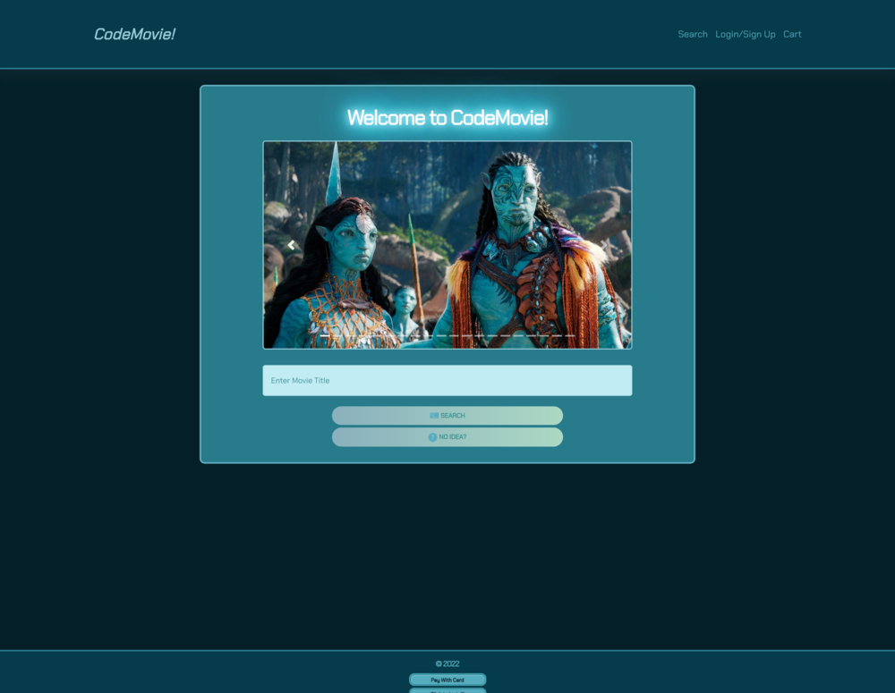
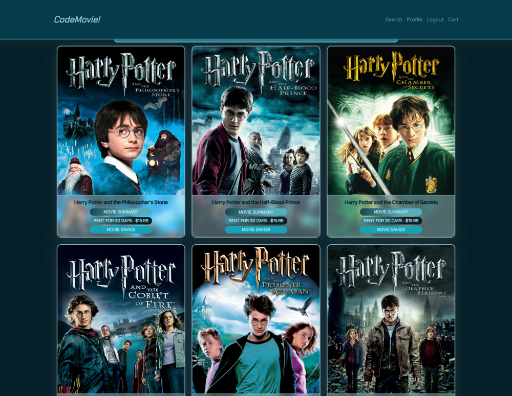
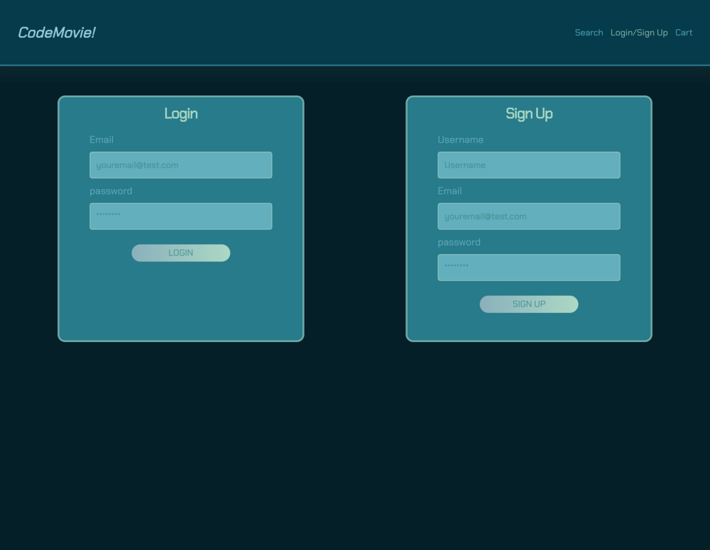
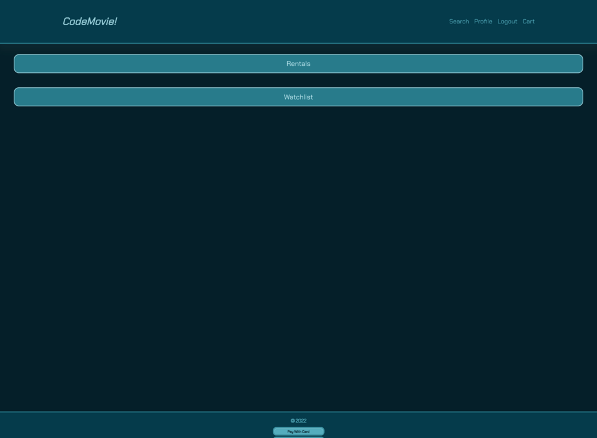

# Code Movie! Ecommerce application

  

## Description
  CodeMovie! is a website where users can go to find their favorite movies. Once logged in, they can search by title for a movie or do a random discover; and then add it to their rental cart or watchlist. Users will be able to find all of their rented and saved movies  in their profile. After the rental is started, the user is able to see how long they have until the rental expires.

## Table of Contents
  - [Installation](#installation)
  - [Usage](#usage)
  - [Deployed Application](#deployed-application)
  - [Screenshots](#screenshots)
  - [Tests](#tests)
  - [Contributing](#contributing)
  - [Questions](#questions)
  - [Licenses](#licenses)

## Installation
  Users will clone the repository. After cloning, run `npm install` to install the dependencies.

## Usage
  Enter `npm run start` or `npm run develop` into the terminal to open this application on your local machine.
  
  OR

  Go to the offical deployed Heroku appication and sign up for an account. Once signed up you can search and discover movies. You will be able to rent or add these movies to your wishlist. When you add movies to your cart; you can click the stripe checkout button to rent the movie. On the profile page you will find your rentals and your watchlist.

## Deployed Application

  * [Deployed website](https://codemovie.herokuapp.com/)

  * [Code Repository](https://github.com/AMore080/ecommerce.git)

## Screenshots

## Tests
  Testing completed with GraphQL and Apollo, as well as REACT devtools

## Contributing
  Can add implementation for google, apple and samsung pay, enhancements to styling

## Questions
  Have questions about this project?  

  Developers GitHubs and Emails: 
  * https://github.com/AMore080
  * https://github.com/DalPenny
  * https://github.com/dhoffman03
  * https://github.com/gt1222

  Developers Emails: 
  * AMore080@github.io.com 
  * Dalpenny@github.io.com
  * dhoffman03@github.io.com
  * gt1222@github.io.com
  
## Licenses
  This project is covered under the MIT license. Please click on the license button to get more info.